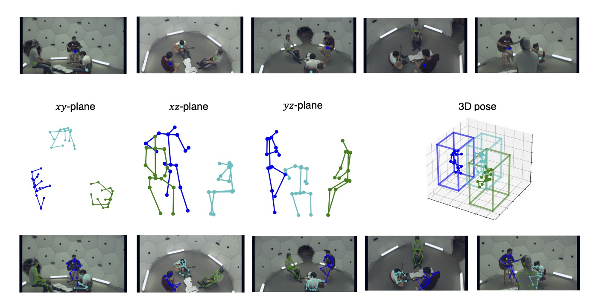
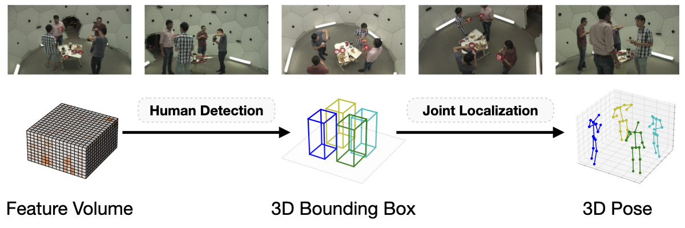

# Faster VoxelPose
This is the official implementation for:
> **[Faster VoxelPose: Real-time 3D Human Pose Estimation by Orthographic Projection](https://arxiv.org/pdf/2207.10955.pdf)**,            
> Hang Ye, Wentao Zhu, Chunyu Wang, Rujie Wu, and Yizhou Wang       
> *ECCV 2022*



## Environment
```bash
conda install pytorch torchvision cudatoolkit=<your cuda version>
pip install -r requirements.txt
```

## Data 
We use the Shelf/Campus and CMU Panoptic datasets. Please refer to [VoxelPose](https://github.com/microsoft/voxelpose-pytorch#data-preparation) for detailed instructions.

The directory tree should look like this:
```
${ROOT}
|-- data
    |-- Panoptic
        |-- 16060224_haggling1
        |   |-- hdImgs
        |   |-- hdvideos
        |   |-- hdPose3d_stage1_coco19
        |   |-- calibration_160224_haggling1.json
        |-- 160226_haggling1  
        |-- ...
    |-- Shelf
    |   |-- Camera0
    |   |-- ...
    |   |-- Camera4
    |   |-- actorsGT.mat
    |   |-- calibration_shelf.json
    |   |-- pred_shelf_maskrcnn_hrnet_coco.pkl
    |-- Campus
    |   |-- Camera0
    |   |-- Camera1
    |   |-- Camera2
    |   |-- actorsGT.mat
    |   |-- calibration_campus.json
    |   |-- pred_campus_maskrcnn_hrnet_coco.pkl
    |-- panoptic_training_pose.pkl
```

## Training


### CMU Panoptic dataset

Train and validate on the five selected camera views. You can specify the GPU devices and batch size per GPU in the config file. 
```bash
python run/train.py --cfg configs/panoptic/jln64.yaml
```
### Shelf/Campus datasets
```bash
python run/train.py --cfg configs/shelf/jln64.yaml
python run/train.py --cfg configs/campus/jln64.yaml
```

## Evaluation
### CMU Panoptic dataset

Evaluate the models. It will print evaluation results to the screen./
```
python run/validate.py --cfg configs/panoptic/jln64.yaml
```
### Shelf/Campus datasets

It will print the PCP results to the screen.
```
python run/validate.py --cfg configs/shelf/jln64.yaml
python run/validate.py --cfg configs/campus/jln64.yaml
```

## Citation
If you use our code or models in your research, please cite with:
```bibtex
@inproceedings{fastervoxelpose,
    author={Ye, Hang and Zhu, Wentao and Wang, Chunyu and Wu, Rujie and Wang, Yizhou},
    title={Faster VoxelPose: Real-time 3D Human Pose Estimation by Orthographic Projection},
    booktitle = {European Conference on Computer Vision (ECCV)},
    year = {2022}
}
```
